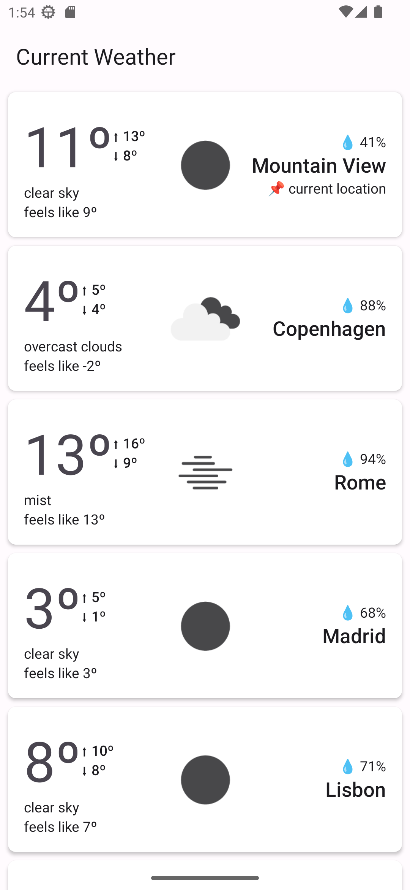

# myweatherapp

Simple app to show current weather in some default locations, which the app loads from [defaultCities.json](core/data/src/main/assets/defaultCities.json).
It also shows the weather on the user current location, if permission is granted.

# setup

To use the app with **OpenWeatherMap** API, just set your `API_KEY`, on [secrets.defaults.properties](secrets.defaults.properties)

# preview

# architecture

Best practices based on `nowinandroid` project, which follows the [official architecture guidance](https://developer.android.com/topic/architecture)
